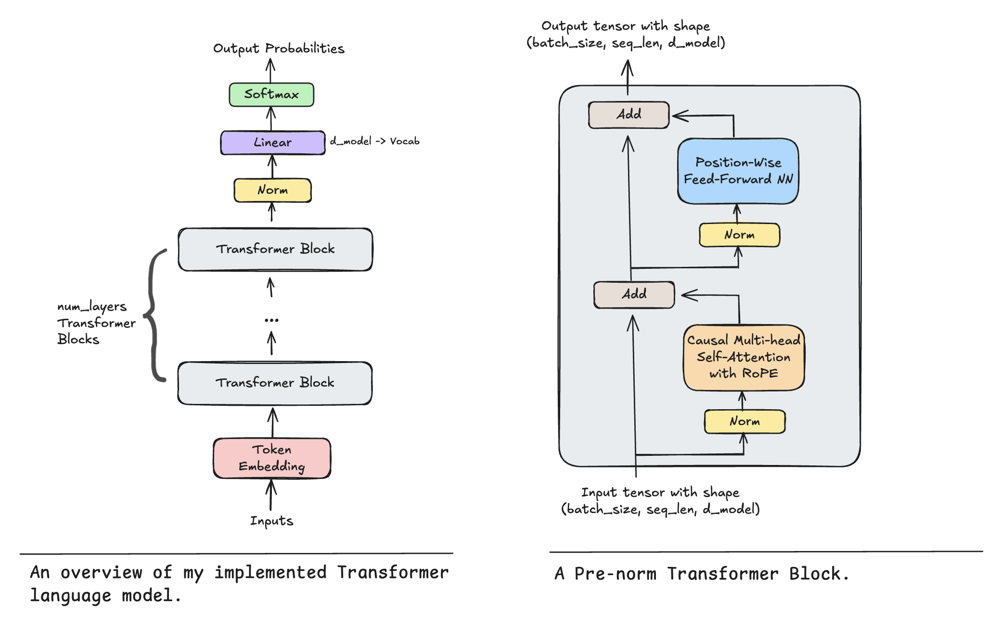

# llm-from-scratch
一个基于Transformer、从零全新编写实现的高性能语言模型。本项目聚焦大模型现代架构的细粒度底层实现，脱离PyTorch高层封装抽象接口，清晰展示大语言模型的底层运行机制，并且该项目可直接进行训练。

## Overview
本仓库提供完整的Transformer大语言模型实现。项目核心设计理念：**完全不依赖高层torch.nn封装层**（例如 nn.Linear、nn.LayerNorm、nn.Transformer）。

### Key Technical Features
* **模型架构：**
    * **前置归一化：** 在模块运算前做归一化，提升训练稳定性
    * **RMSNorm：** 均方根归一化，计算速度更快
    * **SwiGLU激活：** 实现Llama架构所使用的门控线性单元变体
    * **旋转位置编码(RoPE)：** 搭载自动扩容缓存实现，支持灵活可变的序列长度
* **训练与优化：**
    * **自定义AdamW：** 基于torch.optim.Optimizer基类从零搭建
    * **学习率调度：** 余弦退火算法，保障收敛效果
    * **梯度裁剪：** 防止高强度训练过程中出现梯度爆炸

## 🏗 Architecture
本模型严格遵循如下架构流程设计：

## 📂 Project Structure
├── main/
│   ├── model.py                # Transformer核心组件实现
│   ├── tokenizer_optimized.py   # 自定义BPE分词与编码模块
│   ├── train_model.py          # 训练工具与优化器逻辑
│   ├── run_train_model.py      # 训练启动入口
│   └── play_model.ipynb        # 模型推理交互脚本
├── tokenized_data/             # 训练用预处理数据集
├── trained_tokenizer/          # 分词器保存目录
├── img/                        # 架构示意图资源
├── run.sh                      # 一键运行脚本
└── generate_tree.py            # 项目目录生成工具

## 🛠 Usage (to train it urself)
该实现经过效率优化，可在消费级硬件正常训练，包含苹果M系列芯片MacBook Pro设备。

### Quick Start
使用自有数据集自行训练，快速开始步骤：
1. 克隆项目仓库。
2. 确保环境已安装PyTorch。
3. 配置分词器，补全trained_tokenizer与tokenized_data数据目录内容。
4. 运行训练脚本（可按需微调部分参数）：
    ./run.sh

## 🧪 Implementation Constraints
为体现底层实现严谨性，项目刻意舍弃torch.nn高层封装。仅使用Torch基础原生组件：
- torch.nn.Parameter：用于权重初始化与参数管理
- 容器类：Module、ModuleList、Sequential，仅用于计算图模块化管理
- torch.optim.Optimizer：仅作为基类，从零完整手写AdamW

## Lessons Learned
脱离高层nn组件、纯手工搭建Transformer，暴露出大量不易察觉的工程难点：

#### 1. 自定义层的数值稳定性
手动实现RMSNorm、Softmax，深刻认识数值稳定的重要性。脱离原生LayerNorm后，需要精准控制极小值epsilon，避免平方根倒数运算出现除零、溢出问题。

#### 2. 旋转位置编码(RoPE)的细节难点
实现RoPE需要深入理解复数旋转逻辑。最大难点是设计自动扩容的旋转频率缓存，让模型可处理超出训练长度的序列，且无需每次重复计算旋转矩阵。

#### 3. 手动权重运算逻辑
nn.Linear 内部实际运算为 y = xW转置，而非常规 Wx，根源是PyTorch行优先内存布局。手动运算加深了张量内存排布与底层计算逻辑的理解。

#### 4. 优化器状态维护
从零基于基础优化器实现AdamW，完整掌握参数状态管理。需要手动维护全部参数的一阶、二阶动量，严格实现解耦权重衰减，规避原生Adam正则化不足的问题。